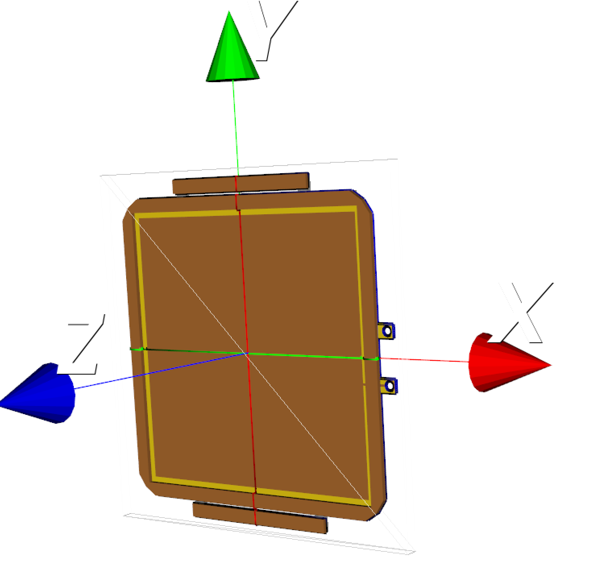
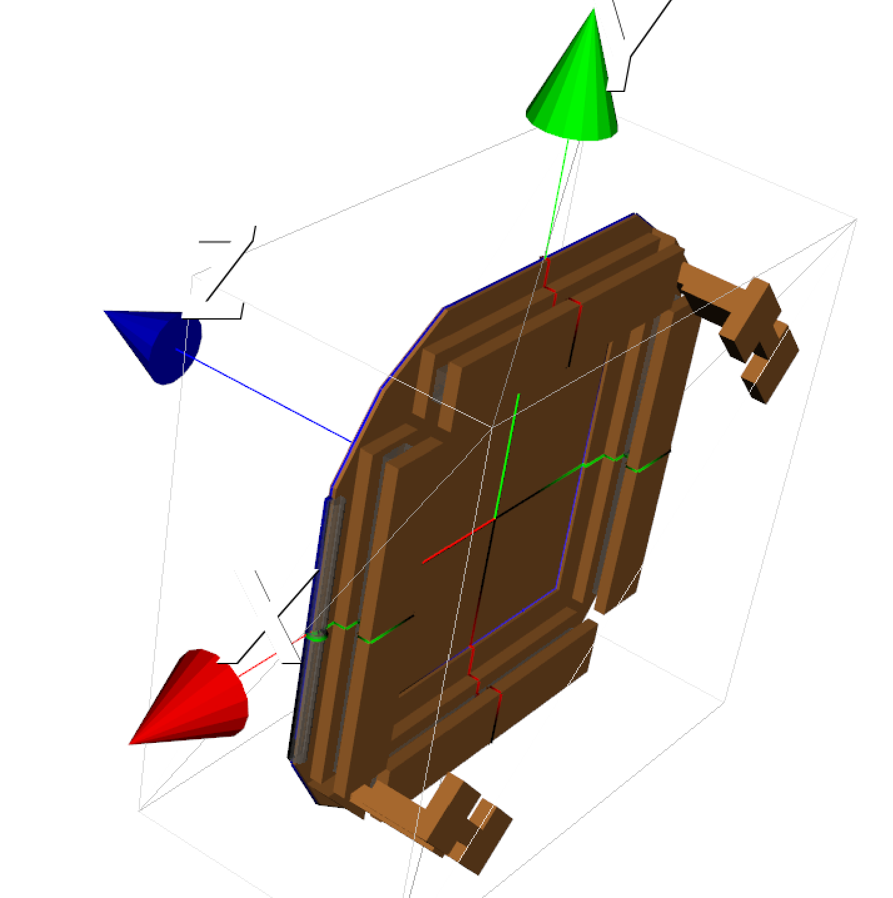
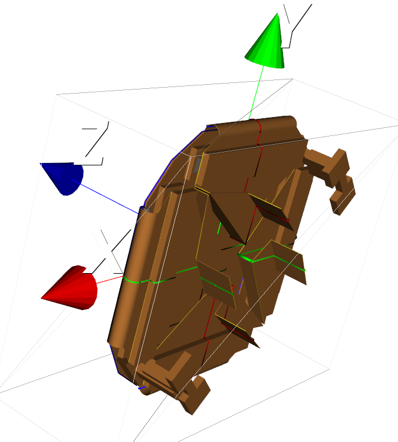

# Geometry generator
To avoid writing the gdml files by hand, we use the python package [pyg4ometry](https://github.com/g4edge/pyg4ometry) to generate the gdml files of the detector. The detector geometry is divided in different components which can be created as assemblies. In a second step, they are integrated together using the script [trexdm.py](trexdm.py). The different detector components are:
## Vessel
The vessel assembly is composed of the following physical volumes:
* vessel
* gas

## GEM
The GEM assembly is composed of the following physical volumes:
* gemKaptonFoil
* gemTop
* gemBottom
* gemFrame
* gemmMSeparator1 (to 2)
* gemmMSeparatorFixer1 (to 2)

*GEM assembly for the right side.*

## Micromegas
The Micromegas assembly is meant to contain the Micromegas readout supporting structure, the Micromegas readout itself and the limandes. It is composed of the following physical volumes:
* mMBase
* mMTeflonSpacerPad1 (to 4)
* mMBaseClosingBracket1 (to 4)
* mMBaseTeflonRoller1 (to 2)
* mMSupport1 (to 2)
* mMBoardCopper
    * mMBoardKapton
        * mMCopperFoilLayer2
        * mMCopperFoilLayer3
* limande1 (to 4)
    * limandeInnerA (or B)

*Left: right side micromegas assembly without the mMBoardCopper and limande1 (to 4) physical volumes. Right: the full right side micromegas assembly.*
